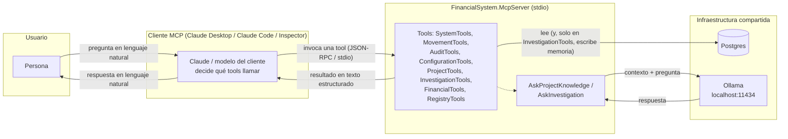

# Guía de usuario del Financial MCP

Esta guía está escrita para alguien que **desarrolló** `FinancialSystem` (o lo conoce
por dentro) pero **nunca usó** `FinancialSystem.McpServer` desde un cliente MCP real
(Claude Desktop, Claude Code, MCP Inspector, etc.). No asume que hayas leído el
código de `hosts/FinancialSystem.McpServer/`, aunque todo lo que dice acá sale de
leerlo.

Esta guía documenta **el comportamiento real del código que existe hoy**. No describe
el diseño ideal ni funcionalidades planeadas — para eso están `docs/Decisions/ADR-006-
financial-mcp-roadmap-investigacion.md` y `docs/Architecture/Decisions/ADR-007-
McpMemory.md`, que esta guía referencia explícitamente en la sección 9. Donde el
código y las ADRs (o la documentación operativa existente,
`docs/Architecture/McpServerSetup.md`) no coinciden, se indica explícitamente — ver
sección 8.

Para la guía puramente operativa (compilar/ejecutar/conectar, sin las secciones
pedagógicas de acá) ya existe `docs/Architecture/McpServerSetup.md`. Esta guía la
complementa: agrega el "cómo pensar el MCP", el catálogo completo tool por tool, los
flujos reales de uso y las buenas prácticas que se desprenden de leer el código.

---

## 1. ¿Qué es este MCP?

### El objetivo del proyecto

`FinancialSystem.McpServer` es un servidor [Model Context Protocol](https://modelcontextprotocol.io/)
— un proceso .NET independiente (`hosts/FinancialSystem.McpServer/`) que expone el
estado del sistema financiero como *tools* que un cliente MCP puede invocar durante
una conversación: movimientos bancarios y de tarjeta, su clasificación, cuentas,
categorías, contrapartes, documentación del proyecto, y (desde ADR-007) memoria de
investigaciones.

Según ADR-006, el MCP **cambió de objetivo** durante su desarrollo: no nació, ni es
hoy, un simple proveedor de métricas financieras (eso ya lo hacía `FinancialTools`
antes de que existiera la ADR). Es, según sus propias palabras, el **"compañero de
investigación del sistema"** — su valor no está en repetir preguntas que el
dashboard de la aplicación ya responde, sino en poder **inspeccionar el estado
interno**: por qué un movimiento quedó clasificado así, qué período financiero
(`EffectiveDate`) terminó persistido, por qué algo no aparece en un período, qué
reglas aplicó el motor de sugerencias.

### Qué problema intenta resolver

Antes de que existiera este MCP, investigar ese tipo de pregunta requería agregar
logging temporal a mano en código de producción, redeployar, leer logs, y después
revertir la instrumentación — no había una forma reutilizable de "preguntarle" al
sistema desde afuera. El MCP resuelve eso exponiendo, como tools invocables desde un
cliente conversacional, lo que ya existe en el dominio: los mismos servicios que ya
usan la pantalla Movimientos, el motor de sugerencias, el motor de detección de
sospechosos, y (para investigaciones) una memoria persistente propia.

### Qué NO hace todavía

Estos puntos están desarrollados con más detalle en la sección 8, pero como
resumen inicial:

* **No escribe datos financieros.** Con la única excepción de `CreateInvestigation`
  (que también existe como `POST /api/investigations` en `FinancialMcp.Api`), el MCP
  nunca crea ni modifica `Transaction`, `BankStatement` ni `ClassifiedMovement`. Toda
  reclasificación real sigue pasando por la aplicación (API/UI).
* **No es un agente autónomo.** No decide qué tool llamar, no encadena llamadas, no
  corre ningún loop de razonamiento propio. El razonamiento vive siempre del lado del
  cliente MCP (ver sección 3).
* **No tiene IA para clasificar ni sugerir automáticamente.** Las únicas dos tools
  que usan un modelo de lenguaje (`AskProjectKnowledge`, `AskInvestigation`) responden
  preguntas puntuales sobre contexto ya armado por la propia tool — no analizan un
  movimiento ni sugieren una categoría por su cuenta (eso sigue siendo
  `IClassificationSuggestionService`, consumido hoy solo por `AuditTools`, no por
  IA).
* **No retroalimenta las auditorías con lo investigado.** El historial de
  investigaciones (ADR-007 Fase 5) todavía no alimenta ninguna señal nueva en
  `AuditTools`.
* **No tiene interfaz propia.** Todo pasa siempre por un cliente MCP externo — no
  hay una UI, ni una API HTTP propia del MCP más allá del proceso stdio.

---

## 2. Cómo levantarlo (desde cero)

Estos pasos asumen que no tenés nada corriendo todavía: ni Postgres, ni el proyecto
compilado, ni ningún cliente MCP configurado.

### 2.1. Requisitos

* **.NET 9 SDK** — mismo `TargetFramework` (`net9.0`) que el resto del repositorio.
* **PostgreSQL** accesible con el connection string configurado (ver 2.2). No hace
  falta ningún otro proceso del repositorio corriendo — ni `FinancialMcp.Api` ni
  `FinancialSystem.Worker` son requisito para el MCP.
* **Ollama** corriendo localmente (opcional) — solo si vas a usar `AskProjectKnowledge`
  o `AskInvestigation` (ver sección 4.6 y 4.7). El resto de las tools no lo necesita.

### 2.2. Levantar Postgres

El repositorio no incluye un `docker-compose.yml` ni un `Dockerfile` propio para
Postgres — hay que levantarlo por tu cuenta, apuntando el connection string al
resultado. La forma más rápida si tenés Docker instalado:

```bash
docker run --name financialsystem-postgres \
  -e POSTGRES_USER=postgres \
  -e POSTGRES_PASSWORD=postgres \
  -e POSTGRES_DB=financialsystem \
  -p 5432:5432 \
  -d postgres:16
```

Esto levanta un Postgres 16 escuchando en `localhost:5432`, con una base
`financialsystem` ya creada, usuario `postgres` y contraseña `postgres` — exactamente
los valores que ya trae `appsettings.json` por defecto (ver 2.3), así que si usás
este comando tal cual no hace falta tocar nada más.

Si preferís una instalación local de Postgres (sin Docker), alcanza con que exista
una base llamada `financialsystem` accesible con esas credenciales, o con las que
vayas a configurar en el paso siguiente.

No hace falta correr migraciones a mano: `Program.cs` llama a
`DatabaseMigrationExtensions.ApplyMigrationsAsync` al arrancar, que aplica cualquier
migración pendiente contra la base configurada — y falla con error si Postgres no
está accesible. Es decir: si el proceso arranca sin tirar error de conexión, el
esquema ya quedó al día.

### 2.3. Configurar el connection string

`hosts/FinancialSystem.McpServer/appsettings.json` (y `appsettings.Development.json`
para desarrollo) ya traen:

```json
"ConnectionStrings": {
  "Postgres": "Host=localhost;Port=5432;Database=financialsystem;Username=postgres;Password=postgres"
}
```

Si tu Postgres corre con esos mismos valores (por ejemplo, si usaste el comando
`docker run` de arriba tal cual), no hace falta cambiar nada. Para apuntar a otra
base, la forma más simple es editar ese valor directamente. Si preferís no tocar el
archivo (por ejemplo en CI, o para no versionar credenciales distintas),
`Host.CreateApplicationBuilder` ya incluye el proveedor de variables de entorno
estándar de .NET, así que también se puede pisar sin cambiar código:

```bash
export ConnectionStrings__Postgres="Host=mi-host;Port=5432;Database=financialsystem;Username=...;Password=..."
```

### 2.4. Compilar

Desde la raíz del repositorio:

```bash
dotnet build hosts/FinancialSystem.McpServer/FinancialSystem.McpServer.csproj
```

(o `dotnet build FinancialSystem.sln` para compilar todo el repositorio de una vez).

### 2.5. Ejecutar el McpServer

Con Postgres corriendo y el connection string apuntando a él:

```bash
dotnet run --project hosts/FinancialSystem.McpServer/FinancialSystem.McpServer.csproj
```

Esto compila (si hace falta) y arranca el proceso. También podés ejecutar el binario
ya compilado directamente:

```bash
dotnet hosts/FinancialSystem.McpServer/bin/Debug/net9.0/FinancialSystem.McpServer.dll
```

**Importante — el transporte es stdio, no HTTP.** `Program.cs` configura
`AddMcpServer().WithStdioServerTransport()`: el servidor no abre ningún puerto ni
escucha conexiones de red. Está pensado para que un cliente MCP lo lance como
subproceso y le hable por stdin/stdout; el proceso vive mientras ese cliente lo
mantenga abierto (`host.RunAsync()` bloquea hasta que el transporte se cierra).
Ejecutarlo "suelto" en una terminal, como en el comando de arriba, sirve para
verificar que arranca sin errores, pero no hay ninguna interacción útil por teclado
— no vas a poder "escribirle" nada a esa terminal. El log de arranque (incluida la
aplicación de migraciones) se escribe por stderr, así que ver texto en la terminal al
arrancar es esperable y no es un error.

Si el proceso se queda "colgado" sin más salida después del log de arranque, **eso
es lo esperado**: está esperando a que un cliente MCP real le hable por stdin. Para
cortarlo, `Ctrl+C`.

### 2.6. Configurar un cliente MCP

Todos los clientes stdio necesitan, en esencia, el mismo dato: qué comando y qué
argumentos ejecutar.

* **Comando:** `dotnet`
* **Argumentos:** `run --project hosts/FinancialSystem.McpServer/FinancialSystem.McpServer.csproj`
* **Directorio de trabajo:** la raíz del repositorio (para que las rutas relativas de
  `appsettings.json` y de `docs/` — usadas por `ProjectTools`, ver 4.5 — resuelvan
  bien).

**Claude Code:** el repositorio incluye `.mcp.json` en la raíz con esta configuración
lista para usar — Claude Code lo detecta automáticamente al abrir el proyecto, no
hace falta ningún paso manual adicional.

**Claude Desktop:** agregar al `claude_desktop_config.json` del usuario (la ubicación
depende del SO; ese archivo vive fuera del repositorio, no se puede versionar acá):

```json
{
  "mcpServers": {
    "financial-mcp": {
      "command": "dotnet",
      "args": [
        "run",
        "--project",
        "/ruta/absoluta/a/FinancialSystem/hosts/FinancialSystem.McpServer/FinancialSystem.McpServer.csproj"
      ]
    }
  }
}
```

(Con Claude Desktop hace falta ruta absoluta al `.csproj`, a diferencia de
`.mcp.json` de Claude Code, que ya resuelve rutas relativas a la raíz del proyecto
abierto.)

**Sin un cliente de IA a mano:** el [MCP Inspector](https://modelcontextprotocol.io/legacy/tools/inspector)
oficial permite conectarse por stdio y listar/invocar tools manualmente, sin
necesidad de Claude ni de ningún otro modelo:

```bash
npx @modelcontextprotocol/inspector dotnet run --project hosts/FinancialSystem.McpServer/FinancialSystem.McpServer.csproj
```

### 2.7. Verificar que está funcionando con `Ping`

Una vez conectado el cliente, invocá la tool `Ping` (clase `SystemTools`, sin
parámetros). La respuesta esperada es exactamente el texto `pong`. Si eso funciona,
el proceso arrancó, el SDK MCP registró las tools y el transporte stdio está vivo —
**pero todavía no confirma que la base de datos esté accesible.**

Para eso está `Health` (misma clase): sin parámetros, devuelve si el MCP puede
conectarse a Postgres, qué proveedor usa, y qué migración de esquema tiene aplicada.
Es el segundo chequeo recomendado después de `Ping` — si `Health` reporta "Degradado",
casi cualquier otra tool que consulte datos va a fallar.

---

## 3. Cómo pensar el MCP

### El MCP no es una aplicación

Es tentador pensar en `FinancialSystem.McpServer` como "otra app más" del
repositorio, al lado de `FinancialMcp.Api` y `FinancialSystem.Worker`. No lo es, en
un sentido importante: no tiene interfaz propia, no responde nada por su cuenta, y
no decide nada. Es literalmente **un conjunto de funciones (tools) que otro programa
— el cliente MCP — invoca una por una**, con los parámetros que ese cliente decide,
en el orden que ese cliente decide. El MCP nunca inicia una acción: solo responde
cuando se le pide, con exactamente los datos de esa tool puntual.

Esto es un principio explícito de ADR-006: *"El razonamiento sigue del lado del
cliente MCP (Claude Desktop, Claude Code, ChatGPT, etc.) — el servidor no es un
agente autónomo, no corre su propio loop de decisiones."*

### Los cinco actores, y cómo no confundirlos

| Actor | Qué es | Qué hace | Qué NO hace |
|---|---|---|---|
| **Base de datos** (Postgres) | El único lugar donde vive la verdad financiera: movimientos, clasificación, catálogos, y (desde ADR-007) investigaciones. | Persiste y devuelve datos cuando se le consulta. | No razona, no expone nada por sí sola — todo pasa por `Application`/`Infrastructure`. |
| **MCP** (`FinancialSystem.McpServer`) | Un proceso .NET que expone *tools* de solo lectura (mayormente) sobre esa base, vía stdio. | Ejecuta exactamente la tool que se le pide, con los parámetros recibidos, y devuelve texto estructurado. | No decide qué tool llamar, no encadena tools entre sí, no tiene memoria de la conversación (cada llamada es independiente salvo lo que el cliente le repita como parámetro). |
| **Cliente MCP** (Claude Desktop, Claude Code, MCP Inspector, un cliente propio) | El programa que lanza el MCP como subproceso, le habla por stdin/stdout, y decide qué tools invocar y en qué orden. | Mantiene la conversación, decide la estrategia, encadena llamadas a tools según lo que necesite responder. | No tiene acceso directo a Postgres — todo lo que sabe del sistema financiero se lo tiene que pasar el MCP a través de una tool. |
| **Claude** (el modelo, cuando el cliente es Claude Desktop/Code) | El modelo de lenguaje que razona dentro del cliente MCP y decide qué tools invocar. | Interpreta la pregunta del usuario, elige tools, interpreta sus resultados, arma una respuesta en lenguaje natural. | No corre dentro del MCP ni depende de él para existir — el MCP es solo una fuente de datos más para Claude. |
| **Ollama** | Un modelo de lenguaje local (`llama3.2` por defecto, `http://localhost:11434`), consultado únicamente **desde dos tools puntuales del propio MCP** (`AskProjectKnowledge`, `AskInvestigation`, ver 4.6/4.7 y 5.5). | Responde una pregunta en lenguaje natural, dado un contexto que la tool ya armó. | No consulta la base de datos directamente en ninguna fase (principio explícito de ADR-007 §7) — todo lo que "sabe" se lo pasa la tool que lo invoca. No decide qué hacer con su respuesta ni encadena nada. |

La confusión más común es mezclar "Claude" con "Ollama": son dos modelos de lenguaje
distintos, con roles distintos. Claude (u otro cliente MCP) es quien está "afuera",
decidiendo qué tools llamar durante toda la conversación. Ollama solo aparece
"adentro" de dos tools puntuales, como un paso más de esas tools — nunca decide qué
tool ejecutar, ni siquiera sabe que existen tools, más allá del catálogo de texto que
se le pasa como contexto de lectura (ver 4.6/4.7).

### Diagrama



Puntos clave del diagrama:

* La flecha de la persona nunca llega directo al MCP — siempre pasa por el cliente.
* El MCP habla con Postgres para casi todas las tools, pero solo escribe en las
  tablas de investigaciones (`InvestigationTools`) — nunca en datos financieros.
* Ollama solo entra en escena dentro de dos tools puntuales, y nunca toca Postgres
  directamente.

---

## 4. Todas las tools

Ocho clases, `[McpServerToolType]`, descubiertas automáticamente por
`WithToolsFromAssembly()` (no hace falta registrar nada a mano en `Program.cs` para
agregar una tool nueva a una clase existente, ni una clase nueva en
`hosts/FinancialSystem.McpServer/Tools/`).

Convención de "movimiento" que comparten varias tools: un movimiento se identifica
siempre por **`sourceEntityType`** (`Transaction` para tarjeta, `BankStatement` para
banco) + **`sourceId`** (el Guid de esa fila en su tabla de origen) — nunca por el Id
de `ClassifiedMovement`. Es la misma convención que usa el resto del sistema
(`ClassifiedMovementItem`) y la que reutiliza la memoria de investigaciones
(ADR-007 §4).

### 4.1. `SystemTools`

Herramientas de diagnóstico del propio servidor. Ninguna depende del dominio
financiero; `Health` es la única que toca la base, y solo para verificar
conectividad — no para leer datos de negocio.

#### `Ping`

**¿Para qué sirve?** Confirma que el proceso MCP está corriendo y responde al
protocolo.

**¿Cuándo usarla?** Siempre como primer paso al conectar un cliente nuevo, antes de
invocar cualquier otra tool — si `Ping` no responde, ninguna otra tool va a funcionar.

**Ejemplo:** invocar `Ping()`, sin parámetros.

**Resultado esperado:** el texto literal `pong`. No hay variantes de error — o
responde eso, o el proceso no está corriendo/conectado.

#### `Version`

**¿Para qué sirve?** Informa la versión de ensamblado (`AssemblyVersion`), el
`InformationalVersion` completo, el commit de origen (si el build corrió dentro de un
repositorio git — comportamiento estándar del SDK .NET 8+, sin SourceLink) y la fecha
de última escritura del `.dll` compilado.

**¿Cuándo usarla?** Antes de reportar un bug, para saber exactamente qué build está
corriendo del lado del servidor.

**Ejemplo:** invocar `Version()`, sin parámetros.

**Resultado esperado:** un texto de varias líneas con `AssemblyVersion`,
`InformationalVersion`, `Commit` y fecha de compilación (UTC) — cualquiera de esos
campos puede decir "no disponible" si el build no lo generó (por ejemplo, un
`InformationalVersion` sin `+commit` si no corrió dentro de un repo git).

#### `Health`

**¿Para qué sirve?** Verifica si el MCP puede conectarse a Postgres, qué proveedor
usa (`Npgsql`, en este proyecto) y qué migración de esquema tiene aplicada.

**¿Cuándo usarla?** Como segundo chequeo, justo después de `Ping`, y en general
cuando algo no anda: si otra tool devuelve un error inesperado, `Health` ayuda a
descartar (o confirmar) un problema de conectividad antes de investigar el caso
puntual.

**Ejemplo:** invocar `Health()`, sin parámetros.

**Resultado esperado:** un texto con `Estado general: OK` (o `Degradado` si no puede
conectar), si está conectado, el proveedor, la última migración aplicada y la hora
UTC actual. Si Postgres no responde, no lanza una excepción sin manejar: reporta
`Degradado` y sigue funcionando (es la única tool que trata la falta de conexión
como un resultado válido, no como un error).

---

### 4.2. `MovementTools`

Ninguna tool de esta clase recalcula nada por su cuenta: `SearchMovements` reutiliza
`IMovementsQueryService` (el mismo servicio detrás de `GET /api/movements`, que a su
vez consume `movements.html`), y `GetMovement`/`ExplainMovement`/
`ExplainClassification` reutilizan `IMovementLookupService` (una sola consulta por
llamada). Los filtros que `IMovementsQueryService` no expone (categoría,
contraparte, tipo, impacto, estado, moneda, rango de importe) se aplican en memoria
sobre el resultado ya calculado por ese servicio — no es una segunda implementación
del query.

Todas las tools con parámetro de fecha comparten el mismo límite: **rango máximo de
90 días** (misma razón en toda la clase: el motor de revisión compara movimientos
par a par dentro del período, con costo no lineal).

#### `SearchMovements`

**¿Para qué sirve?** Busca movimientos (banco y tarjeta, pendientes y ya
clasificados) en un rango de fechas, con filtros opcionales por texto, categoría,
contraparte, impacto financiero, tipo de movimiento, estado, moneda y rango de
importe.

**¿Cuándo usarla?** Cuando no se conoce el `sourceId` exacto de un movimiento — para
encontrar uno o varios a partir de criterios de búsqueda (ej. "los movimientos de
`MERCADOPAGO` en junio", o "todo lo pendiente de clasificar este mes").

**Ejemplo:** `SearchMovements(from: "2026-06-01", to: "2026-06-30", text: "farmacia")`.

**Resultado esperado:** una lista de movimientos que matchean, en texto estructurado
(uno por movimiento, con Id, fecha bancaria, período financiero, descripción,
importe, categoría, contraparte, tipo, impacto y estado) — o el texto "No se
encontraron movimientos..." si ninguno matchea. Si `from`/`to` son inválidos o el
rango supera 90 días, devuelve un texto de error explícito (no una excepción).

#### `GetMovement`

**¿Para qué sirve?** Devuelve el detalle completo de un movimiento puntual: dato
crudo, cuenta financiera, información técnica (archivo de origen, ExternalId, cupón o
detalle bancario según el origen), clasificación (si ya la tiene), información de
procesamiento y grupo de matching.

**¿Cuándo usarla?** Ya se conoce el `sourceEntityType` + `sourceId` de un movimiento
(por ejemplo, porque lo devolvió `SearchMovements`) y se necesita verlo entero.

**Ejemplo:** `GetMovement(sourceEntityType: "Transaction", sourceId: "3f2e...-...")`.

**Resultado esperado:** un texto largo con secciones "Movimiento", "Información
técnica", "Clasificación" (o "pendiente" si no la tiene), "Información de
procesamiento" y "Grupo de matching" — o "No se encontró ningún Transaction/
BankStatement con Id ..." si no existe.

#### `ExplainMovement`

**¿Para qué sirve?** Da el mismo detalle que `GetMovement`, pero reorganizado en
secciones **siempre iguales** (Movimiento / Clasificación / Procesamiento / Matching /
Observaciones), pensado para que un LLM lo use como base de razonamiento sin tener
que interpretar prosa libre. La sección "Observaciones" es una lista de hechos
derivados de datos ya existentes (ej. "Sin contraparte asignada.", "Fue reclasificado
al menos una vez.") — **no evalúa nada nuevo, no usa IA, no inventa umbrales.**

**¿Cuándo usarla?** Cuando se necesita el mismo dato que `GetMovement` pero en un
formato estable, por ejemplo para pasarlo como contexto a un modelo o para comparar
varios movimientos con la misma estructura.

**Ejemplo:** `ExplainMovement(sourceEntityType: "BankStatement", sourceId: "9a1c...-...")`.

**Resultado esperado:** texto con las cinco secciones fijas mencionadas; la sección
Observaciones puede decir "(sin observaciones)" si no aplica ninguna.

#### `ExplainClassification`

**¿Para qué sirve?** Responde puntualmente **por qué** un movimiento terminó con su
clasificación actual — a partir de `ProcessingSource` (el único dato que
`ClassifyMovementHandler` persiste sobre el origen de la clasificación), sin inventar
una relación causal que el sistema no guarda. Si el movimiento fue reclasificado
después de su clasificación inicial, lo advierte explícitamente (porque
`ProcessingSource` no se actualiza al reclasificar — describe el origen inicial, no
necesariamente el de los valores actuales).

**¿Cuándo usarla?** Cuando la pregunta es específicamente sobre el **origen** de la
clasificación (¿fue manual? ¿vino de un matching legado?), no sobre el movimiento en
general — para eso, `ExplainMovement`.

**Ejemplo:** `ExplainClassification(sourceEntityType: "Transaction", sourceId: "...")`.

**Resultado esperado:** texto con secciones Movimiento / Estado / "Cómo se obtuvo esa
clasificación" / Matching / Procesamiento / Observaciones. Si el movimiento está
pendiente, la sección de origen dice directamente "Sin clasificar todavía -- no hay
origen que explicar."

---

### 4.3. `AuditTools`

Ninguna regla de detección nueva vive acá: son la exposición, en texto estructurado,
de dos señales que ya existen en el dominio. Comparten el mismo límite de 90 días que
`MovementTools`.

#### `FindSuspiciousMovements`

**¿Para qué sirve?** Devuelve los grupos de movimientos que `ISuspicionDetector`
(orquestado por `IReviewEngine`) ya marca como sospechosos — posibles duplicados o
transacciones divididas ("splits") — dentro de un período. Es el mismo motor que ya
usa la pantalla Movimientos; esta tool no agrega ninguna heurística nueva.

**¿Cuándo usarla?** Para auditar un período antes de confiar en sus totales — por
ejemplo, después de importar un resumen nuevo.

**Ejemplo:** `FindSuspiciousMovements(from: "2026-06-01", to: "2026-06-30")`.

**Resultado esperado:** texto con la cantidad de grupos y movimientos involucrados,
y por cada grupo: tipo y motivo de sospecha, tamaño del grupo, y el detalle de cada
movimiento (Id, cuenta, fecha, importe, moneda, descripción). Si no hay grupos, dice
"No se detectaron movimientos sospechosos...". El campo "Score o severidad" siempre
muestra `-`: `ISuspicionDetector` no calcula un score numérico, solo pertenencia a un
grupo por motivo — la tool no inventa uno.

#### `FindMisclassifiedMovements`

**¿Para qué sirve?** Encuentra movimientos **ya clasificados** cuya clasificación
actual no coincide con dos señales objetivas: (1) lo que sugeriría
`IClassificationSuggestionService` según el historial de descripciones idénticas (el
mismo motor que sugiere para pendientes, aplicado acá sobre movimientos ya
clasificados), y (2) los valores por defecto configurados en la `Counterparty` del
movimiento (`Counterparty.Default*`, ADR-003). No aplica ninguna regla nueva ni IA —
solo compara valores que ya existen.

**¿Cuándo usarla?** Para encontrar candidatos a reclasificar antes de confiar en las
métricas de un período — típicamente después de auditar duplicados con
`FindSuspiciousMovements`.

**Ejemplo:** `FindMisclassifiedMovements(from: "2026-06-01", to: "2026-06-30")`.

**Resultado esperado:** texto con la cantidad de movimientos señalados y, por cada
uno, sus datos básicos más una lista de "Motivos" — cada motivo indica su origen
(historial de descripción, o default de contraparte), la dimensión afectada
(Categoría/Tipo/Impacto/Contraparte), el valor actual, el valor sugerido y, si aplica,
la confianza (solo la señal 1 tiene noción de confianza; la señal 2, al ser una
comparación de igualdad directa, nunca la tiene). Si no hay movimientos clasificados
en el rango, o ninguno tiene motivos, lo indica explícitamente en texto.

---

### 4.4. `ConfigurationTools`

Catálogos del sistema — qué cuentas, categorías y contrapartes existen realmente, sin
IA, sin memoria, sin reglas nuevas. `ListFinancialAccounts` reutiliza
`IFinancialAccountQueryService` (el mismo servicio de `GET /api/accounts`);
`Category`/`Counterparty` no tienen un servicio de consulta dedicado, así que estas
tools consultan `IApplicationDbContext` directo, igual que sus propios endpoints HTTP.

#### `ListFinancialAccounts`

**¿Para qué sirve?** Lista todas las cuentas financieras configuradas, activas e
inactivas.

**¿Cuándo usarla?** Antes de filtrar otra tool por `financialAccountId`, para saber
qué Ids existen.

**Ejemplo:** `ListFinancialAccounts()`, sin parámetros.

**Resultado esperado:** texto con la cantidad de cuentas y, por cada una, Id, nombre,
tipo, moneda y estado (activa/inactiva).

#### `ListCategories`

**¿Para qué sirve?** Lista todas las categorías configuradas, activas e inactivas.

**¿Cuándo usarla?** Antes de filtrar otra tool por `categoryId`.

**Ejemplo:** `ListCategories()`, sin parámetros.

**Resultado esperado:** texto con Id, nombre para mostrar (y nombre técnico entre
paréntesis), tipo (`Sistema` o `Usuario`, según `IsSystem` — `Category` no tiene un
campo de "tipo de negocio" ni "impacto financiero" propio, esas son dimensiones de
`ClassifiedMovement`, no de `Category`) y estado.

#### `ListCounterparties`

**¿Para qué sirve?** Lista todas las contrapartes configuradas, activas e inactivas,
sin resolver sus defaults (para eso, `GetCounterparty`).

**¿Cuándo usarla?** Antes de filtrar otra tool por `counterpartyId`.

**Ejemplo:** `ListCounterparties()`, sin parámetros.

**Resultado esperado:** texto con Id, nombre, tipo y estado de cada contraparte.

#### `GetCounterparty`

**¿Para qué sirve?** Devuelve el detalle completo de una contraparte puntual,
incluyendo sus defaults configurados (categoría, tipo de movimiento e impacto
financiero por defecto).

**¿Cuándo usarla?** Ya se conoce el Id de la contraparte y hace falta ver sus
defaults — por ejemplo, para entender por qué `FindMisclassifiedMovements` señaló un
motivo del tipo "Default configurado en la contraparte".

**Ejemplo:** `GetCounterparty(id: "b7d1...-...")`.

**Resultado esperado:** texto con Id, nombre, tipo, estado, notas, y los tres
defaults configurados (o `-` si alguno no está seteado) — o "No se encontró ninguna
contraparte con Id ..." si no existe.

#### `SearchCounterparties`

**¿Para qué sirve?** Busca contrapartes por nombre (contiene, sin distinguir
mayúsculas) — mismo filtro que ya usa `GET /api/counterparties?search=`.

**¿Cuándo usarla?** No se conoce el Id exacto, solo parte del nombre.

**Ejemplo:** `SearchCounterparties(text: "mercado")`.

**Resultado esperado:** texto con las contrapartes que contienen ese texto (Id,
nombre, tipo, estado) — o "No se encontraron contrapartes que contengan '...'." si
ninguna matchea.

---

### 4.5. `ProjectTools`

Lectura directa de los `.md` de `docs/` (copiados al directorio de salida del build,
preservando su estructura de carpetas) — sin parsear Markdown, sin IA, salvo la
excepción explícita de `AskProjectKnowledge`.

#### `ListArchitectureDocuments`

**¿Para qué sirve?** Lista los documentos `.md` de `docs/Architecture/` (nombre
relativo, uno por línea).

**¿Cuándo usarla?** Antes de `ReadArchitectureDocument`, para saber qué nombre pedir.

**Ejemplo:** `ListArchitectureDocuments()`, sin parámetros.

**Resultado esperado:** texto con la cantidad de documentos y su lista de nombres
relativos a `docs/Architecture/` (ej. `Architecture.md`, `McpServerSetup.md`).

#### `ReadArchitectureDocument`

**¿Para qué sirve?** Devuelve el contenido crudo (sin interpretar) de un documento de
`docs/Architecture/`.

**¿Cuándo usarla?** Ya se sabe el nombre exacto (por `ListArchitectureDocuments`) y
se necesita el contenido completo.

**Ejemplo:** `ReadArchitectureDocument(fileName: "Architecture.md")`.

**Resultado esperado:** el archivo tal cual está guardado — o un error si `fileName`
no existe, o si intenta escapar la carpeta (`..`, ruta absoluta): la tool valida esto
explícitamente comparando la ruta resuelta contra la raíz permitida.

#### `SearchDocumentation`

**¿Para qué sirve?** Búsqueda de texto literal (sin distinguir mayúsculas, sin IA,
sin ranking) en **todos** los `.md` de `docs/` (`Architecture`, `Decisions`, `Epics`,
`RoadMaps`, `UX`, `Archive`, `patch`) — igual que un `grep` simple.

**¿Cuándo usarla?** No se sabe en qué documento buscar, y se quiere encontrar dónde
se menciona un término (ej. un nombre de tool, una entidad del dominio, un ADR).

**Ejemplo:** `SearchDocumentation(query: "EffectiveDate")`.

**Resultado esperado:** texto con la cantidad de coincidencias y, por cada una,
archivo:línea + el texto de esa línea — con un tope de 50 coincidencias (si se
alcanza, lo indica explícitamente diciendo que hay más sin mostrar).

#### `GetRoadmap`

**¿Para qué sirve?** Devuelve el contenido crudo de
`docs/RoadMaps/FinancialMcp-vNext.md` — la fuente de verdad del roadmap, según su
propio encabezado.

**¿Cuándo usarla?** Se necesita el estado y la visión general del proyecto tal como
está documentada, sin resumen ni interpretación.

**Ejemplo:** `GetRoadmap()`, sin parámetros.

**Resultado esperado:** el archivo completo tal cual está guardado.

#### `AskProjectKnowledge`

**¿Para qué sirve?** Responde una pregunta sobre el proyecto **usando Ollama**, con
`docs/RoadMaps/FinancialMcp-vNext.md` (la misma lectura que `GetRoadmap`) más el
catálogo de tools MCP (`ToolRegistry.ToLlmCatalog()`, ver sección 8) como contexto.
No accede a la base de datos, no escribe nada, no llama a ninguna otra tool ni
decide qué tool usar: arma contexto + pregunta y devuelve la respuesta de Ollama tal
cual.

**¿Cuándo usarla?** La pregunta necesita una respuesta en lenguaje natural sobre el
proyecto — no solo el texto crudo de un documento (para eso, `GetRoadmap`/
`ReadArchitectureDocument`).

**Ejemplo:** `AskProjectKnowledge(question: "¿Por qué el MCP no escribe clasificaciones directamente?")`.

**Resultado esperado:** la respuesta de Ollama en lenguaje natural — o un mensaje de
error explícito si Ollama no está corriendo o no responde (ver 5.5 sobre qué pasa
concretamente cuando eso ocurre).

---

### 4.6. `InvestigationTools`

La única clase que **escribe** algo — pero nunca datos financieros. Escribe en sus
propias tablas de memoria (`Investigation`, `InvestigationReference`,
`InvestigationFinding`, ver ADR-007). Cada tool de escritura delega en el mismo
handler de `Application` que usaría cualquier otra entrada — `CreateInvestigation`
reutiliza el mismo caso de uso que `POST /api/investigations`; el resto
(`LinkMovement`/`AddFinding`/`UpdateInvestigationStatus`) no tiene endpoint HTTP
propio, solo existe como tool MCP.

#### `CreateInvestigation`

**¿Para qué sirve?** Crea una investigación nueva en estado `Open`. No busca, no
edita, no crea referencias ni memoria automática: solo registra la pregunta.

**¿Cuándo usarla?** Al empezar a registrar memoria sobre una pregunta o hipótesis
nueva que valga la pena no perder entre conversaciones.

**Ejemplo:** `CreateInvestigation(question: "¿Por qué los movimientos de MERCADOPAGO llegan sin contraparte?", tags: "mercadopago,contraparte")`.

**Resultado esperado:** texto con `InvestigationId`, `Status` (`Open`) y `CreatedAt`
(UTC) de la investigación recién creada. `question` es obligatorio; `tags` es
opcional.

#### `LinkMovement`

**¿Para qué sirve?** Asocia un movimiento existente (por `sourceEntityType` +
`sourceId`) a una investigación ya creada. Es **idempotente**: si el movimiento ya
estaba asociado a esa investigación, no crea una referencia duplicada.

**¿Cuándo usarla?** La investigación necesita referenciar un movimiento puntual como
parte de su contexto — no crea hallazgos ni comentarios, solo el vínculo.

**Ejemplo:** `LinkMovement(investigationId: "...", sourceEntityType: "Transaction", sourceId: "...")`.

**Resultado esperado:** texto con `InvestigationId`, `SourceEntityType`, `SourceId` y
el resultado (`Linked` si es la primera vez, `AlreadyLinked` si ya existía) — o un
error si la investigación no existe.

#### `AddFinding`

**¿Para qué sirve?** Registra un hallazgo (texto libre) en una investigación ya
creada. No modifica el estado de la investigación ni sus referencias. Sin IA, sin
resumen: el texto se guarda tal como se pasa.

**¿Cuándo usarla?** Se encontró algo puntual durante la investigación que vale la
pena dejar registrado, para no tener que redescubrirlo en una conversación futura.

**Ejemplo:** `AddFinding(investigationId: "...", text: "El movimiento X tiene la misma descripción que otros 5 ya clasificados como 'Supermercado', pero este quedó como 'Otros'.")`.

**Resultado esperado:** texto con `InvestigationId`, `FindingId` y `CreatedAt` (UTC)
del hallazgo recién creado — o un error si la investigación no existe.

#### `GetInvestigation`

**¿Para qué sirve?** Devuelve la información completa de una investigación: datos
generales (pregunta, estado, tags, conclusión, fechas), sus referencias
(`SourceEntityType` + `SourceId`) y sus hallazgos ordenados por fecha. **Solo lee**
exactamente lo persistido — no resuelve los movimientos referenciados ni llama a
`GetMovement` (para eso, ver `AskInvestigation`, que sí lo hace).

**¿Cuándo usarla?** Se necesita revisar todo el estado actual de una investigación
puntual, por ejemplo al retomarla en una conversación nueva.

**Ejemplo:** `GetInvestigation(investigationId: "...")`.

**Resultado esperado:** texto con los datos generales, la lista de referencias (o
"(ninguna)") y la lista de hallazgos con su texto y fecha (o "(ninguno)") — o un
error si el Id no existe.

#### `UpdateInvestigationStatus`

**¿Para qué sirve?** Cambia el estado de una investigación entre `Open`,
`InProgress`, `Resolved` y `Discarded`. Si el nuevo estado es `Resolved`, `conclusion`
es **obligatoria** y se guarda; en cualquier otro estado, `conclusion` no se toca.

**¿Cuándo usarla?** La investigación avanzó de etapa (por ejemplo, de `Open` a
`InProgress` al empezar a agregar hallazgos), o se llegó a una conclusión.

**Ejemplo:** `UpdateInvestigationStatus(investigationId: "...", status: "Resolved", conclusion: "Era un problema de normalización de descripciones, ya corregido en la contraparte.")`.

**Resultado esperado:** texto con `InvestigationId`, `Status` y `UpdatedAt` (UTC) — o
un error si el Id no existe, si `status` es inválido, o si falta `conclusion` cuando
`status` es `Resolved`.

#### `SearchInvestigations`

**¿Para qué sirve?** Busca investigaciones por `status` (comparación exacta), `tag`
(contiene) y/o texto libre (contiene en `Question` o `Conclusion`) — los tres
parámetros son opcionales, y sin ninguno devuelve todas las investigaciones. Solo
cuenta hallazgos y referencias, no las devuelve ni resuelve movimientos.

**¿Cuándo usarla?** No se conoce el Id de la investigación, o se quiere ver varias a
la vez (ej. "todas las abiertas", o "todas con el tag `mercadopago`").

**Ejemplo:** `SearchInvestigations(status: "Open")`.

**Resultado esperado:** texto con la cantidad de investigaciones encontradas y, por
cada una, Id, pregunta, estado, tags, fechas, cantidad de hallazgos y de referencias
— o "No se encontraron investigaciones con esos criterios." si ninguna matchea.

#### `AskInvestigation`

**¿Para qué sirve?** Responde una pregunta sobre una investigación puntual **usando
Ollama**, con contexto real: el catálogo de tools MCP, la investigación completa
(estado, pregunta, conclusión, hallazgos) y el **detalle completo de cada movimiento
referenciado** (vía `IMovementLookupService`, el mismo lookup que `GetMovement`).
Es una única llamada a Ollama — no escribe nada en la investigación, no agrega
hallazgos ni actualiza la conclusión, no encadena llamadas ni decide qué otra tool
usar.

**¿Cuándo usarla?** La pregunta requiere razonar sobre los datos reales de la
investigación (ej. "¿por qué este movimiento parece mal clasificado, dado lo que ya
encontramos?"), no solo consultarlos tal cual — para eso, `GetInvestigation`.

**Ejemplo:** `AskInvestigation(investigationId: "...", question: "¿Los movimientos referenciados tienen algo en común que explique por qué llegan sin categoría?")`.

**Resultado esperado:** la respuesta de Ollama en lenguaje natural, el texto literal
`InvestigationNotFound` si el Id no existe, o un mensaje de error si Ollama no
responde.

---

### 4.7. `FinancialTools`

Las **cuatro tools originales** del MCP — existían antes de que se escribiera
ADR-006, y ADR-006 explícitamente no las reemplaza. Delegan en
`IFinancialMetricsService` y devuelven texto plano (no JSON), con montos formateados
en formato `es-AR`. Son las mismas preguntas que responde el dashboard de la
aplicación, hechas accesibles desde el MCP.

#### `GetMonthlySummary`

**¿Para qué sirve?** Resumen financiero de un mes: ingresos, gastos, balance, tasa
de ahorro y cantidad de movimientos procesados (clasificados, con desglose de
confirmados/revisados).

**¿Cuándo usarla?** El usuario pregunta cuánto gastó, cuánto ahorró o cómo le fue en
un mes específico.

**Ejemplo:** `GetMonthlySummary(year: 2026, month: 6)`.

**Resultado esperado:** texto con ingresos, gastos, balance (con signo/positivo o
negativo), tasa de ahorro y cantidad de movimientos — o un error si `month` no está
entre 1 y 12, o si el servicio subyacente falla.

#### `GetExpensesByCategory`

**¿Para qué sirve?** Gastos reales agrupados por categoría en un período, con
porcentaje del total y cantidad de movimientos por categoría.

**¿Cuándo usarla?** El usuario pregunta en qué gasta más, cómo distribuye sus
gastos, o cuánto gastó en una categoría específica.

**Ejemplo:** `GetExpensesByCategory(from: "2026-06-01", to: "2026-06-30")`.

**Resultado esperado:** texto con el total del período y, por categoría, el monto,
el porcentaje del total y la cantidad de movimientos — o "No hay gastos
registrados..." si no hay datos, o un error si las fechas son inválidas o `from` no
es anterior a `to`.

#### `GetMonthlyTrend`

**¿Para qué sirve?** Evolución de gastos e ingresos mes a mes durante los últimos N
meses, con una comparación simple entre el primer y el último mes del rango.

**¿Cuándo usarla?** El usuario pregunta si sus gastos están subiendo o bajando, o
quiere ver una tendencia histórica.

**Ejemplo:** `GetMonthlyTrend(months: 6)`.

**Resultado esperado:** una tabla en texto con gastos/ingresos/balance/ahorro por
mes, más una línea de tendencia ("los gastos subieron/bajaron X (Y%) en el
período") si hay al menos dos meses de datos — o un error si `months` no está entre
1 y 24.

#### `CompareWithPreviousMonth`

**¿Para qué sirve?** Compara los gastos de un mes contra el mes anterior, con
variación absoluta y porcentual, y el top de categorías con mayor variación.

**¿Cuándo usarla?** El usuario pregunta si gastó más o menos que el mes pasado, qué
categorías aumentaron, o si está mejorando su situación financiera.

**Ejemplo:** `CompareWithPreviousMonth(year: 2026, month: 6)`.

**Resultado esperado:** texto con gastos actuales, gastos anteriores (si hay datos
del mes previo), variación, una frase de tendencia ("subieron"/"bajaron"/"se
mantuvieron estables") y hasta 5 categorías con mayor variación — o "No hay datos del
mes anterior para comparar." si no existen.

---

### 4.8. `RegistryTools`

#### `ListAvailableTools`

**¿Para qué sirve?** Devuelve el registro completo de tools MCP disponibles (nombre,
descripción corta, cuándo usarla, parámetros, qué devuelve), agrupadas por clase.
Reutiliza `ToolRegistry` — una lista estática **escrita a mano**, sin reflexión ni
escaneo de ensamblados: no ejecuta ninguna tool, no decide cuál usar.

**¿Cuándo usarla?** Para que un cliente (o una persona) obtenga, en una sola
llamada, un resumen navegable de qué tools existen y cuándo usar cada una — una
alternativa en texto a esta misma guía.

**Ejemplo:** `ListAvailableTools()`, sin parámetros.

**Resultado esperado:** texto agrupado por clase, con nombre, descripción, cuándo
usarla, parámetros y qué devuelve, tool por tool.

> **Actualización (Patch 0077, PATCH-024):** el registro se sincronizó con la
> implementación real (incluidas `FinancialTools`, `AuditDatabaseTools.AuditDatabase`
> — ausente incluso de esta guía hasta este patch — y esta misma tool), y un test
> nuevo (`ToolRegistrySyncTests`) verifica esa consistencia en cada build. La
> advertencia original (`ToolRegistry` omitía 5 de 31 tools reales) queda resuelta;
> se conserva tachada abajo y en la sección 8 por su valor histórico.
>
> ~~**Atención — esta tool está incompleta respecto de la realidad.** `ToolRegistry`
> es una lista mantenida a mano (ver comentario en `ToolRegistry.cs`: *"Si se agrega
> o cambia una tool, esta lista se actualiza a mano en el mismo PR -- no hay ningún
> mecanismo que la mantenga sincronizada automáticamente"*), y hoy **no incluye las
> cuatro tools de `FinancialTools`** (`GetMonthlySummary`, `GetExpensesByCategory`,
> `GetMonthlyTrend`, `CompareWithPreviousMonth`) **ni se incluye a sí misma**
> (`RegistryTools.ListAvailableTools`). Es decir: si le pedís a un cliente que
> "liste las tools disponibles" usando esta tool, la respuesta va a omitir 5 de las
> 31 tools reales del servidor. Ver sección 8 para el detalle de esta
> inconsistencia y su impacto en `AskProjectKnowledge`/`AskInvestigation`.~~

---

## 5. Flujos reales

Esta es la parte más importante de la guía: no alcanza con conocer cada tool por
separado, hace falta saber en qué orden usarlas para un caso real. Todos los flujos
de abajo están armados combinando tools tal como existen hoy — ninguno asume una
tool que no esté implementada.

### 5.1. Importé un resumen nuevo

Situación: se acaba de correr una importación (fuera del alcance del MCP — la
importación en sí la hace `FinancialSystem.Worker`/`FinancialMcp.Api`, no una tool
MCP) y hay que verificar que quedó bien antes de confiar en las métricas del período.

1. **`SearchMovements(from, to)`** — ver qué movimientos entraron en el rango
   importado, en crudo. Sirve para confirmar que la cantidad y el rango de fechas
   son los esperados, y para detectar a simple vista algo raro (importes en cero,
   descripciones vacías, etc.).
2. **`FindSuspiciousMovements(from, to)`** — auditar duplicados o transacciones
   divididas detectadas por el motor existente. Una importación repetida por error,
   por ejemplo, suele aparecer acá como grupo sospechoso.
3. **`FindMisclassifiedMovements(from, to)`** — de lo que ya quedó clasificado
   (normalmente por matching automático contra el historial), ver qué candidatos a
   reclasificar aparecen.
4. **`ExplainMovement(sourceEntityType, sourceId)`** — para cada movimiento puntual
   que llamó la atención en los pasos 2 o 3, ver su detalle estructurado completo.
5. **`ExplainClassification(sourceEntityType, sourceId)`** — si la duda es
   específicamente el origen de la clasificación (¿fue automática? ¿manual?), no solo
   el movimiento en general.
6. **Reclasificar desde la aplicación (Api/UI).** El MCP nunca hace este paso — es
   deliberado (ver sección 1): toda escritura de datos financieros pasa por
   `FinancialMcp.Api`, nunca por una tool MCP.
7. **Volver a ejecutar `FindSuspiciousMovements`/`FindMisclassifiedMovements`** sobre
   el mismo rango, para confirmar que la reclasificación resolvió lo señalado (o para
   ver qué quedó pendiente).
8. **Revisar el Dashboard de la aplicación** — y, si hace falta un cruce rápido
   desde el mismo cliente MCP, `GetMonthlySummary`/`GetExpensesByCategory` sobre el
   mismo período, para confirmar que el número que ve el Dashboard ahora coincide con
   lo que ya se auditó a mano.

### 5.2. Quiero investigar por qué el Dashboard no coincide con la realidad

1. **`GetMonthlySummary(year, month)`** — confirmar el número exacto que el Dashboard
   está mostrando, para tener un punto de comparación preciso (nota: cuenta
   movimientos **clasificados** — `ConfirmedCount`/`ReviewedCount` — no pendientes).
2. **`SearchMovements(from, to, status: "Pending")`** — ver si hay movimientos sin
   clasificar en el período. Si el Dashboard no coincide con "la realidad" (lo que
   aparece en el extracto/resumen bancario), la causa más común es que haya
   movimientos todavía pendientes que el resumen financiero no está contando.
3. **`FindMisclassifiedMovements(from, to)`** — ver si hay movimientos mal
   clasificados que están inflando o desinflando alguna categoría o el total.
4. **`GetExpensesByCategory(from, to)`** — comparar el detalle por categoría contra
   lo esperado, para acotar en qué categoría está la diferencia.
5. Si la causa no queda clara con esto, **`CreateInvestigation`** +
   **`AddFinding`** para dejar registrado qué se probó y qué se descartó, en vez de
   perder ese trabajo al cerrar la conversación (ver 5.4).

### 5.3. Quiero entender un movimiento raro

1. Si no se conoce el Id exacto: **`SearchMovements(from, to, text: "...")`** para
   encontrarlo por descripción, importe o categoría.
2. **`GetMovement(sourceEntityType, sourceId)`** o **`ExplainMovement`** — el
   detalle completo. Usar `ExplainMovement` si además se quiere pasar ese resultado
   como contexto a un modelo (formato más estable); `GetMovement` si alcanza con
   leerlo directamente.
3. Si la duda es puntualmente sobre la clasificación (¿por qué quedó en esta
   categoría/tipo/impacto?): **`ExplainClassification`**.
4. Si el movimiento amerita quedar registrado para no repetir la investigación:
   **`CreateInvestigation`** + **`LinkMovement`** + **`AddFinding`** (ver 5.4).

### 5.4. Quiero abrir una investigación

1. **`CreateInvestigation(question, tags?)`** — registrar la pregunta o hipótesis
   que da origen a la investigación. Guardar el `InvestigationId` que devuelve.
2. **`LinkMovement(investigationId, sourceEntityType, sourceId)`** — por cada
   movimiento relevante que se vaya encontrando (es idempotente: se puede llamar de
   nuevo sin miedo a duplicar la referencia).
3. **`AddFinding(investigationId, text)`** — a medida que se encuentran cosas
   puntuales durante la investigación (un hallazgo por observación, no un resumen
   final acumulado).
4. **`UpdateInvestigationStatus(investigationId, "InProgress")`** — cuando la
   investigación ya tiene desarrollo real, no solo la pregunta inicial.
5. **`UpdateInvestigationStatus(investigationId, "Resolved", conclusion)`** (con
   conclusión obligatoria) cuando se llega a una respuesta, o `"Discarded"` si se
   determina que no amerita seguir.
6. Para retomarla más adelante: **`GetInvestigation(investigationId)`** (si ya se
   tiene el Id) o **`SearchInvestigations(status?, tag?, text?)`** (si no).

### 5.5. Quiero usar Ollama para analizar una investigación

Requisito previo: Ollama corriendo localmente (`http://localhost:11434` por
defecto, configurable en `appsettings.json` bajo la sección `Ollama` — mismo
`Model`/`BaseUrl`/`TimeoutSeconds` que usa el resto del sistema, no una
configuración nueva del MCP). Si Ollama no está corriendo, este flujo falla en el
último paso con un mensaje de error explícito, no con una excepción sin manejar.

1. **`GetInvestigation(investigationId)`** — confirmar que la investigación tiene
   contenido real (hallazgos y/o referencias) antes de preguntarle a Ollama; si está
   vacía, Ollama va a responder con muy poco contexto útil.
2. **`AskInvestigation(investigationId, question)`** — la tool arma automáticamente
   el contexto (catálogo de tools + investigación completa + detalle de cada
   movimiento referenciado, resuelto vía el mismo lookup que `GetMovement`) y hace
   una única llamada a Ollama.
3. Resultado posible: la respuesta de Ollama en lenguaje natural; el texto literal
   `InvestigationNotFound` si el `investigationId` no existe; o un mensaje de error
   si Ollama no responde (por ejemplo: *"No se pudo conectar con Ollama. ¿Está
   ejecutándose localmente?"* o *"Tiempo de espera agotado al consultar Ollama."*,
   según el caso).
4. **La respuesta de Ollama no se guarda sola.** `AskInvestigation` nunca escribe en
   la investigación — si la respuesta aporta algo que vale la pena conservar, hay que
   llamarlo explícitamente con **`AddFinding(investigationId, text)`**, pasando (por
   ejemplo) la respuesta de Ollama como texto del hallazgo.

Lo mismo aplica, con la misma lógica, a **`AskProjectKnowledge(question)`** cuando la
pregunta es sobre el proyecto en general (roadmap, arquitectura) en vez de sobre una
investigación puntual — la diferencia es el contexto que arma la tool: acá es
`GetRoadmap` + catálogo de tools, en vez de una investigación completa.

---

## 6. Qué herramientas usar para cada problema

| Necesito... | Tool recomendada | Por qué |
|---|---|---|
| Confirmar que el MCP está corriendo y conectado | `Ping`, luego `Health` | `Ping` verifica el proceso/protocolo; `Health` verifica además la conexión a Postgres — son dos chequeos distintos, en ese orden. |
| Saber qué versión del MCP tengo corriendo | `Version` | Único lugar que expone `AssemblyVersion`/commit/fecha de build. |
| Encontrar un movimiento sin conocer su Id | `SearchMovements` | Es la única tool de búsqueda por texto/filtros; el resto de las tools de movimiento necesitan `sourceEntityType`+`sourceId` ya conocidos. |
| Ver el detalle completo de un movimiento puntual | `GetMovement` (o `ExplainMovement` si el resultado va a ser leído por un modelo) | Ambas usan el mismo lookup; la diferencia es el formato (libre vs. secciones fijas). |
| Entender por qué un movimiento quedó clasificado así | `ExplainClassification` | Es la única tool enfocada específicamente en el origen (`ProcessingSource`) de la clasificación, sin mezclar el resto del detalle del movimiento. |
| Auditar un período por duplicados o splits | `FindSuspiciousMovements` | Expone directamente `ISuspicionDetector`, el motor que ya usa la pantalla Movimientos — no hay otra tool que cubra esto. |
| Encontrar candidatos a reclasificar en un período ya clasificado | `FindMisclassifiedMovements` | Es la única tool que compara clasificación actual contra historial de descripciones + defaults de contraparte. |
| Saber qué cuentas/categorías/contrapartes existen, para poder filtrar por Id | `ListFinancialAccounts` / `ListCategories` / `ListCounterparties` | Son los únicos catálogos completos — sin ellos, hay que adivinar los Ids. |
| Ver los defaults de clasificación de una contraparte puntual | `GetCounterparty` | Es la única tool que expone `Default*` — `ListCounterparties` no los incluye. |
| Preguntar cuánto gasté/ahorré en un mes | `GetMonthlySummary` | Responde exactamente esa pregunta agregada, sin tener que sumar movimientos a mano. |
| Ver en qué categorías se concentra el gasto de un período | `GetExpensesByCategory` | Es la única tool con el desglose por categoría y porcentaje del total. |
| Ver si los gastos vienen subiendo o bajando | `GetMonthlyTrend` | Es la única tool con una serie de varios meses y una línea de tendencia calculada. |
| Comparar un mes puntual contra el anterior | `CompareWithPreviousMonth` | Es la única tool con variación por categoría entre dos meses consecutivos. |
| Leer un ADR o documento de arquitectura puntual | `ListArchitectureDocuments` + `ReadArchitectureDocument` | Son las únicas tools con acceso de archivo a `docs/Architecture/`. |
| Buscar dónde se menciona un término en toda la documentación | `SearchDocumentation` | Es la única tool que busca en todo `docs/`, no solo en `Architecture/`. |
| Preguntar algo sobre el proyecto en lenguaje natural | `AskProjectKnowledge` | Es la única tool que usa un modelo (Ollama) para responder sobre el roadmap/proyecto en vez de devolver texto crudo. |
| Registrar una pregunta o hipótesis para no perderla entre conversaciones | `CreateInvestigation` | Es el único punto de entrada para crear memoria persistente. |
| Vincular un movimiento a algo que ya se está investigando | `LinkMovement` | Es la única forma de crear esa referencia (idempotente). |
| Dejar constancia de algo puntual que se encontró investigando | `AddFinding` | Es la única forma de agregar un hallazgo a una investigación existente. |
| Retomar una investigación abierta hace tiempo | `GetInvestigation` (con Id) o `SearchInvestigations` (sin Id) | `GetInvestigation` trae todo el detalle de una; `SearchInvestigations` sirve para encontrar cuál. |
| Cerrar o descartar una investigación | `UpdateInvestigationStatus` | Es la única tool que cambia el estado (y exige `conclusion` si el cierre es `Resolved`). |
| Que un modelo razone sobre los movimientos reales de una investigación | `AskInvestigation` | Es la única tool que arma ese contexto completo (investigación + movimientos referenciados) y se lo pasa a Ollama. |
| Ver el catálogo completo de tools desde dentro del MCP | `ListAvailableTools` | Único atajo en texto — sincronizado con la implementación real desde el Patch 0077 (PATCH-024), ver sección 4.8. |

---

## 7. Buenas prácticas

Todas éstas se desprenden directamente de cómo está construido el MCP hoy, no son
recomendaciones genéricas:

* **Confirmar `Ping` y `Health` al conectar un cliente nuevo, en ese orden.** `Ping`
  no dice nada sobre la base de datos; si se salta `Health` y la base no está
  accesible, el primer síntoma va a ser un error confuso en la primera tool que sí
  la necesite.
* **Importar primero, auditar después.** `FindSuspiciousMovements`/
  `FindMisclassifiedMovements` solo tienen sentido sobre datos ya importados — correr
  una auditoría antes de importar simplemente va a devolver "no se encontraron..."
  o resultados de un período viejo.
* **No usar `ExplainClassification` para preguntar por qué un movimiento pendiente
  "no tiene" clasificación.** La tool responde explícitamente "Sin clasificar
  todavía -- no hay origen que explicar" para ese caso — la pregunta correcta para un
  pendiente es `GetMovement`/`ExplainMovement` (ver qué le falta), no
  `ExplainClassification` (que asume que ya tiene una clasificación que explicar).
* **Corregir clasificaciones desde la aplicación antes de mirar el Dashboard, no
  después.** `GetMonthlySummary`/`GetExpensesByCategory` cuentan movimientos ya
  clasificados (`ConfirmedCount`/`ReviewedCount`) — si hay candidatos a reclasificar
  sin corregir (detectados con `FindMisclassifiedMovements`), el Dashboard va a
  reflejar esa clasificación incorrecta hasta que se corrija en la app.
* **Ejecutar auditorías después de cada importación relevante, no solo cuando algo
  parece raro.** `FindSuspiciousMovements`/`FindMisclassifiedMovements` no corren
  automáticamente — cada importación es una oportunidad concreta de introducir
  duplicados o clasificaciones inconsistentes con el historial, y la única forma de
  detectarlo es pedirlo explícitamente.
* **Acotar los rangos de fecha a bloques de hasta 90 días.** `SearchMovements`,
  `FindSuspiciousMovements` y `FindMisclassifiedMovements` rechazan explícitamente
  cualquier rango mayor — para un semestre o un año, hay que partir la consulta en
  varios llamados, no pedir todo de una vez.
* **Mantener las investigaciones acotadas a una pregunta por investigación**, en vez
  de una investigación gigante con hallazgos de temas distintos. `AskInvestigation`
  arma contexto con **todos** los hallazgos y **todos** los movimientos referenciados
  de la investigación — una investigación mezclada hace que ese contexto sea más
  grande y menos relevante para cada pregunta puntual.
* **Usar `SearchMovements`/`GetMovement`/`ExplainMovement` antes de abrir una
  investigación**, no al revés. Si la pregunta se puede responder con una tool de
  solo lectura existente, no hace falta pagar el costo de crear y mantener memoria
  para ella — la memoria es para lo que vale la pena no reinvestigar después (ADR-007
  §1), no para cada consulta puntual.
* **Recordar que ninguna tool corrige nada automáticamente.** `FindSuspiciousMovements`
  y `FindMisclassifiedMovements` señalan candidatos; ninguna de las dos, ni ninguna
  otra tool del MCP, reclasifica por su cuenta — ese paso siempre es manual, en la
  aplicación.
* **`ListAvailableTools` (y el contexto que reciben `AskProjectKnowledge`/
  `AskInvestigation`) enumera el 100% de las tools reales desde el Patch 0077
  (PATCH-024)** — ver sección 4.8 y el detalle de la sección 8. Si en el futuro se
  agrega, saca o renombra una tool sin actualizar `ToolRegistry`,
  `ToolRegistrySyncTests` (`tests/FinancialSystem.McpServer.Tests`) falla el build.

---

## 8. Limitaciones actuales

### Lo que todavía no hace

* **No escribe datos financieros**, salvo `CreateInvestigation` (que además existe
  como endpoint HTTP). Reclasificar, corregir una cuenta, dar de baja una
  contraparte, etc. siguen siendo acciones exclusivas de la aplicación (API/UI) — no
  hay ninguna tool MCP equivalente, ni está prevista en ninguna ADR vigente.
* **No decide ni encadena nada por su cuenta.** Cada tool es una llamada
  independiente; si un flujo necesita cuatro tools en secuencia (ver sección 5), es
  el cliente MCP (o la persona) quien tiene que invocarlas una por una — el servidor
  no tiene ningún mecanismo de orquestación propio.
* **No hay tools dedicadas de IA para analizar un movimiento o sugerir una
  clasificación.** ADR-006 Fase 3 preveía `AnalyzeMovement`, `AnalyzeMonth`,
  `SuggestCategory`, `SuggestCounterparty` usando Ollama — ninguna de esas cuatro
  tools existe hoy. Lo que sí existe (`AskProjectKnowledge`, `AskInvestigation`) es
  más genérico: responde preguntas en lenguaje natural sobre contexto ya armado, no
  analiza un movimiento puntual ni sugiere valores de clasificación.
* **La memoria de investigaciones no retroalimenta las auditorías.**
  `FindSuspiciousMovements`/`FindMisclassifiedMovements` son reglas fijas, sin
  memoria — el historial acumulado de investigaciones no genera todavía ninguna
  señal nueva de auditoría (ADR-007 Fase 5).
* **No hay `FindDuplicates` ni `FindUnclassified` como tools separadas** (mencionadas
  en ADR-006 Fase 2). Lo que existe es `FindSuspiciousMovements` (que ya cubre
  duplicados y splits vía `ISuspicionDetector`) y `FindMisclassifiedMovements` (que
  no es lo mismo que "no clasificado": solo mira movimientos que **ya tienen** una
  clasificación).

### Lo que sigue siendo manual

* Reclasificar un movimiento señalado por `FindMisclassifiedMovements`.
* Corregir un duplicado o split señalado por `FindSuspiciousMovements`.
* Decidir qué tool usar y en qué orden — no hay ningún asistente ni script que arme
  el flujo de la sección 5 por vos; hay que seguirlo a mano (o pedirle al cliente MCP
  que lo siga).
* Guardar la respuesta de `AskProjectKnowledge`/`AskInvestigation` como memoria — hay
  que llamar `AddFinding` a mano si vale la pena conservarla (ver 5.5).
* Mantener `ToolRegistry` (y por lo tanto `ListAvailableTools`) al día — sigue siendo
  una lista escrita a mano, sin ningún mecanismo automático que la actualice sola (ver
  4.8 y más abajo); `ToolRegistrySyncTests` solo avisa cuando se desincroniza, no la
  corrige.

### Inconsistencias detectadas entre el código y la documentación existente

Estas dos inconsistencias se detectaron al escribir esta guía, comparando
`ToolRegistry.cs`/las tools reales contra `docs/Architecture/McpServerSetup.md` y las
ADRs. Se documentan acá explícitamente en vez de "corregirlas" silenciosamente en
otro archivo:

1. ~~**`ToolRegistry` (y por lo tanto `ListAvailableTools`, y el contexto que reciben
   `AskProjectKnowledge`/`AskInvestigation` vía `ToolRegistry.ToLlmCatalog()`) no
   incluye las 4 tools de `FinancialTools`** (`GetMonthlySummary`,
   `GetExpensesByCategory`, `GetMonthlyTrend`, `CompareWithPreviousMonth`) **ni se
   incluye a sí mismo** (`RegistryTools.ListAvailableTools`). El propio comentario de
   `ToolRegistry.cs` documenta que es una lista mantenida a mano, sin mecanismo de
   sincronización automática — pero no advierte que hoy, concretamente, faltan estas
   5 tools de las 31 reales. El efecto práctico: un modelo que solo mire ese catálogo
   (por ejemplo, Ollama dentro de `AskProjectKnowledge`) no se entera de que existen
   esas 5 tools.~~

   **Resuelto (Patch 0077, PATCH-024).** El inventario completo por reflexión hecho
   para ese patch encontró, además, una sexta tool ausente que ni siquiera esta guía
   había detectado: `AuditDatabaseTools.AuditDatabase` — el total real era 32, no 31.
   `ToolRegistry` ahora incluye las 32 (`FinancialTools` completo, `AuditDatabase` y
   `ListAvailableTools`), y `tests/FinancialSystem.McpServer.Tests/ToolRegistrySyncTests.cs`
   (nuevo) verifica por reflexión, en cada build, que el registro y la implementación
   real coincidan exactamente — para que esta inconsistencia no vuelva a pasar
   inadvertida. `ToolRegistry` sigue siendo una lista mantenida a mano por decisión de
   diseño (ver su doc-comment); lo nuevo es solo la red de seguridad que avisa cuando
   se desincroniza.
2. **`docs/Architecture/McpServerSetup.md` afirma, en su tabla de fases, que la Fase
   3 de ADR-006 ("IA local") y la Fase 4 de ADR-007 ("Integración con Ollama") no
   están implementadas**, con el texto literal *"No hay ninguna tool del MCP que use
   Ollama/OpenAI hoy"*. Esto no es así: `ProjectTools.AskProjectKnowledge` e
   `InvestigationTools.AskInvestigation` **ya usan Ollama hoy**, vía `ILocalAiService`
   (implementado por `OllamaLocalAiService`, registrado sin condición en
   `AddInfrastructure` — el mismo `AddInfrastructure` que usa `Program.cs` del MCP).
   Esta guía documenta el comportamiento real: esas dos tools existen, están activas,
   y llaman a Ollama — lo que **no** existe todavía son las tools puntuales de
   análisis que preveía originalmente ADR-006 Fase 3 (`AnalyzeMovement`,
   `AnalyzeMonth`, `SuggestCategory`, `SuggestCounterparty`), que sí son distintas de
   `AskProjectKnowledge`/`AskInvestigation` y siguen sin implementarse.

---

## 9. Roadmap

Relación entre esta guía y las dos ADRs que gobiernan la evolución del MCP —
`docs/Decisions/ADR-006-financial-mcp-roadmap-investigacion.md` (roadmap general de
tools) y `docs/Architecture/Decisions/ADR-007-McpMemory.md` (memoria de
investigaciones). Ninguna fase marcada como implementada acá se infiere de la ADR —
se verificó contra el código descrito en la sección 4.

### ADR-006 — roadmap general de tools

| Fase | Objetivo | Estado real | Tools |
|---|---|---|---|
| (Previa a la ADR) | Métricas financieras agregadas | ✅ Implementada | `FinancialTools` completo (sección 4.7) |
| Fase 1 — Investigación básica | Inspeccionar completamente el estado del sistema | ✅ Implementada, más `ExplainClassification` (no estaba en el listado original de la ADR) | `Ping`, `Version`, `Health`, `SearchMovements`, `GetMovement`, `ExplainMovement`, `ExplainClassification` |
| Fase 1.5 — Conocimiento del proyecto | Que el LLM entienda el dominio sin re-explicarlo cada vez | ✅ Implementada, con nombres distintos a los sugeridos en la ADR (`SearchDocs`/`ReadAdr`/`ExplainConcept`/`GetArchitecture` → `ListArchitectureDocuments`/`ReadArchitectureDocument`/`SearchDocumentation`/`GetRoadmap`) | `ProjectTools` (sin contar `AskProjectKnowledge`, que es Fase 4) |
| Fase 2 — Auditoría | Encontrar inconsistencias automáticamente | ⚠️ Parcial — `FindSuspiciousMovements`/`FindMisclassifiedMovements` existen; `FindDuplicates`/`FindUnclassified` (nombrados en la ADR) no están implementados como tools separadas | `AuditTools` completo |
| Fase 3 — IA local | Tools puntuales que usen Ollama para analizar/sugerir | ❌ No implementada tal como la describe la ADR (`AnalyzeMovement`/`AnalyzeMonth`/`SuggestCategory`/`SuggestCounterparty` no existen) — ver también la inconsistencia de la sección 8 sobre qué sí usa Ollama hoy | (ninguna de las nombradas en la ADR) |
| Fase 4 — Memoria | Memoria persistente de investigaciones | Reemplazada por su propia ADR (ADR-007) | ver tabla siguiente |

`ConfigurationTools` no está listada en ninguna fase de ADR-006 — se agregó como
complemento natural de Fase 1 (catálogos de configuración) sin encajar literalmente
en el texto original de la ADR.

### ADR-007 — memoria del MCP

| Fase | Objetivo | Estado real |
|---|---|---|
| Fase 1 — Sin memoria | Tools de solo lectura ya construidas | ✅ (es la Fase 1/1.5/2 de ADR-006 de arriba) |
| Fase 2 — Persistencia de investigaciones | Tablas `Investigation`/`InvestigationReference`/`InvestigationFinding` | ✅ Implementada |
| Fase 3 — Tools de investigaciones | Crear/actualizar/consultar investigaciones | ✅ Implementada — `InvestigationTools` (sección 4.6), sin contar `AskInvestigation` |
| Fase 4 — Integración con Ollama | Ollama como contexto adicional sobre lo que ya devuelven las tools | ✅ Implementada como `AskInvestigation` (y, del lado de ADR-006, como `AskProjectKnowledge`) — contradice la tabla de fases de `docs/Architecture/McpServerSetup.md`, ver sección 8 |
| Fase 5 — Auditorías inteligentes basadas en memoria | Nuevas señales de auditoría a partir del historial de investigaciones, siempre como sugerencia para revisión humana | ❌ No implementada — `AuditTools` no consulta `Investigation`/`InvestigationFinding` en ningún punto hoy |

### Qué mirar primero si esta guía queda desactualizada

Como ninguna de las dos ADRs se actualiza automáticamente con el código (son
documentos de decisión, no generados), y `ToolRegistry` tampoco se mantiene solo
(sección 8), la forma más confiable de verificar el estado real en el futuro es la
misma que se usó para escribir esta guía: leer directamente las clases de
`hosts/FinancialSystem.McpServer/Tools/*.cs` — son la única fuente que no puede
quedar desactualizada respecto de sí misma.
